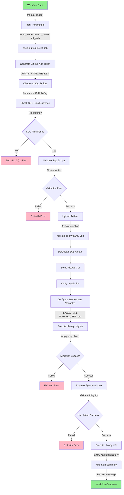

# Flyway Database Migration Workflow

## Table of Contents

- [Abstract](#abstract)
- [Flyway Usage](#flyway-usage)
  - [Setup Redgate Flyway Action](#setup-redgate-flyway-action)
  - [Environment Variables](#environment-variables)
  - [Flyway Commands](#flyway-commands)
  - [SQL Migration File Naming Convention](#sql-migration-file-naming-convention)
- [Workflow Flow Diagram](#workflow-flow-diagram)
- [Input Parameters](#input-parameters)
- [Required GitHub Secrets](#required-github-secrets)
- [Usage Example](#usage-example)
- [Troubleshooting](#troubleshooting)
- [Additional Resources](#additional-resources)
- [Author & Attribution](#author--attribution)
- [License & Usage](#license--usage)

---

## Abstract

This GitHub Actions workflow demonstrates automated database schema migration using **Flyway**, a popular version control tool for database migrations. The workflow is designed to:

- Accept repository configuration as input parameters (repo name, branch, SQL path)
- Checkout SQL migration scripts from a GitHub repository within the same organization
- Validate SQL scripts for correctness and compliance
- Execute database migrations using Flyway CLI
- Validate migration results and provide migration history

This automation enables **CI/CD integration** for database changes, ensuring consistent and reliable schema evolution across environments (Dev, Test, Production).

---

## Flyway Usage

### Setup Redgate Flyway Action

The workflow uses the official **[red-gate/setup-flyway](https://github.com/red-gate/setup-flyway)** action to install Flyway CLI.

#### Action Configuration
```yaml
- name: Setup Flyway
  uses: red-gate/setup-flyway@v3
  with:
    version: latest           # Flyway version (latest, 9, 10, 11, etc.)
    edition: community        # Edition: community, teams, or enterprise
    i-agree-to-the-eula: true # EULA acceptance required
```

### Environment Variables

Flyway configuration is managed through environment variables:

| Variable | Description | Example |
|----------|-------------|---------|
| `FLYWAY_DRIVER` | Database JDBC driver class | `org.postgresql.Driver` |
| `FLYWAY_URL` | Database connection URL | `jdbc:postgresql://host:5432/dbname` |
| `FLYWAY_USER` | Database username | Stored in GitHub Secrets |
| `FLYWAY_PASSWORD` | Database password | Stored in GitHub Secrets |
| `FLYWAY_LOCATIONS` | Path to migration files | `filesystem:./sql-migrations` |
| `FLYWAY_BASELINEONMIGRATE` | Allow baseline on first migration | `true` |
| `FLYWAY_VALIDATEONMIGRATE` | Validate migrations during execution | `true` |

**Note:** Sensitive credentials (`DB_HOST`, `DB_USER`, `DB_PASSWORD`) are stored in GitHub repository secrets and referenced as `${{ secrets.SECRET_NAME }}`.

### Flyway Commands

The workflow uses three primary Flyway commands:

#### 1. **flyway migrate**
Executes all pending migrations in sequence, updating the database schema.

```bash
flyway migrate
```

**Documentation:** [Flyway Migrate Command](https://documentation.red-gate.com/fd/migrate-184127391.html)

#### 2. **flyway validate**
Validates that all migrations have been applied correctly and checks for integrity.

```bash
flyway validate
```

**Documentation:** [Flyway Validate Command](https://documentation.red-gate.com/fd/validate-184127393.html)

#### 3. **flyway info**
Displays the migration history and status of all applied migrations, showing version, description, and installation date.

```bash
flyway info
```

**Documentation:** [Flyway Info Command](https://documentation.red-gate.com/fd/info-184127392.html)

### SQL Migration File Naming Convention

Flyway requires specific filename patterns for migration scripts:

**Versioned Migrations (most common):**
```
V{version}__{description}.sql
```
Examples:
- `V1__Initial_schema.sql`
- `V2__Create_users_table.sql`
- `V3__Add_user_roles.sql`

**Repeatable Migrations (runs on every deployment):**
```
R__{description}.sql
```
Examples:
- `R__Create_views.sql`
- `R__Refresh_materialized_views.sql`

**Important:** Flyway is strict about naming conventions. Files that don't match these patterns will be ignored.

---

## Workflow Flow Diagram



---

## Input Parameters

The workflow accepts the following input parameters via `workflow_dispatch`:

| Parameter | Description | Default | Example |
|-----------|-------------|---------|---------|
| `repo_name` | Repository name (from same GitHub Org) | `github-actions-demo` | `my-database-scripts` |
| `branch_name` | Git branch name | `master` | `develop`, `feature/new-schema` |
| `sql_path` | Path to SQL migration directory | `db-migrate-script` | `database/migrations`, `sql/flyway` |
| `db_port` | PostgreSQL database port | `5432` | `5433` |
| `db_name` | Database name | `demo` | `production_db` |

---

## Required GitHub Secrets

Configure the following secrets in your GitHub repository (Settings → Secrets and variables → Actions):

| Secret | Description |
|--------|-------------|
| `APP_ID` | GitHub App ID for token generation |
| `PRIVATE_KEY` | GitHub App private key (PEM format) |
| `DB_HOST` | PostgreSQL host address |
| `DB_USER` | PostgreSQL username |
| `DB_PASSWORD` | PostgreSQL password |

---

## Usage Example

1. Navigate to **Actions** tab in your GitHub repository
2. Select **"Simple Flyway workflow to migrate DB by SQL Script"**
3. Click **"Run workflow"**
4. Fill in the input parameters:
   - Repo name: `github-actions-demo`
   - Branch name: `master`
   - SQL path: `db-migrate-script`
   - Database port: `5432`
   - Database name: `demo`
5. Click **"Run workflow"** to execute
---

## Troubleshooting

### Issue: "SQL migrations were detected but not run because they did not follow the filename convention"
**Solution:** Rename SQL files to follow Flyway naming convention: `V1__Description.sql`

### Issue: "Unable to connect to the database"
**Solution:** Verify GitHub secrets are configured correctly (`DB_HOST`, `DB_USER`, `DB_PASSWORD`)

### Issue: "WARNING: No locations configured"
**Solution:** Ensure `FLYWAY_LOCATIONS` environment variable is set to correct path

---

## Additional Resources

- [Flyway Official Documentation](https://documentation.red-gate.com/fd/)
- [Flyway Commands Reference](https://documentation.red-gate.com/fd/flyway-commands-184127390.html)
- [PostgreSQL JDBC Driver](https://jdbc.postgresql.org/)
- [GitHub Actions Documentation](https://docs.github.com/en/actions)

---

## Author & Attribution

**Author:** Cyrus Cheng  
**Website:** [https://cyrus822.com/personal](https://cyrus822.com/personal)  
**GitHub:** [https://github.com/t217145](https://github.com/t217145)

---

## License & Usage

This workflow and documentation are provided as-is for educational and commercial use. 

**Important:** If you use, modify, or distribute this workflow, please provide proper attribution to **Cyrus Cheng**. Include a reference to the original source and indicate any modifications made.

**Attribution Example:**
> "Based on the Flyway Database Migration Workflow by Cyrus Cheng (https://cyrus822.com/personal)"

---

*Last Updated: February 2026*
